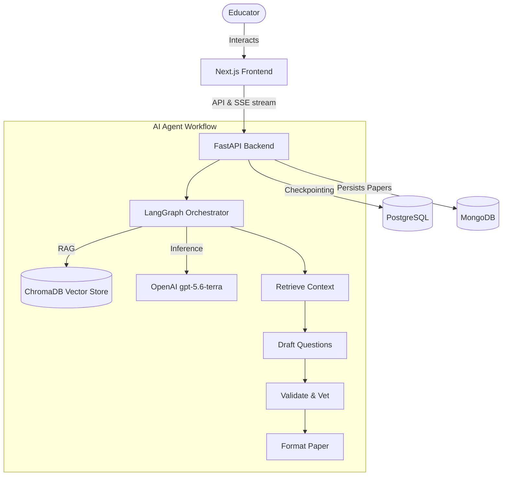

<div align="center">
  
  <h1>ExamForge: AI-Powered Exam Generator</h1>
  <p><strong>Automating standard-compliant question paper generation using LangGraph & LLMs</strong></p>
  
  <p>
    
    
    
    
    
    
  </p>
</div>

---

## 📌 Project Description

Crafting quality question papers that strictly follow official **CBSE blueprints** (Marks distribution, difficulty levels, and topologies like MCQs, Case-based, and Long Answers) is an incredibly time-consuming process for educators. Generic AI tools fall short because they hallucinate or fail to adhere to rigid syllabus constraints.

**ExamForge** is a full-stack AI agentic application acting as a Subject Matter Expert. By ingesting official NCERT textbooks, it ensures absolute syllabus accuracy. Under the hood, it orchestrates a panel of AI agents using **LangGraph** to draft, stringently vet, and format exam papers exactly to standard.

## ✨ Key Features

- 📚 **Context-Aware (RAG):** Ingests official NCERT textbooks (ChromaDB) to anchor the AI to the official curriculum.
- 🤖 **Multi-Agent Vetting:** A multi-step LangGraph workflow drafts raw questions, and a secondary agent rigorously filters out questions that violate topology or difficulty constraints.
- ⚡ **Real-time SSE Streaming:** As the AI pipeline runs, Server-Sent Events stream the node-by-node progress back to the Next.js frontend in real-time.
- 📂 **History & Library:** All generated papers are persisted in MongoDB and beautifully rendered on the web.

---

## 🏗 System Architecture

The project consists of a highly scalable and decoupled architecture:



### 🔹 Component Breakdown
1. **Frontend (Client):** Located in the `frontend` submodule. Built with **Next.js**, React, Tailwind CSS, and TypeScript.
2. **Backend (Agent):** The core API built with **FastAPI** (Python).
3. **Orchestrator:** **LangGraph** manages the stateful agent workflow.
4. **Storage:**
   - **MongoDB** for document storage (exam papers, metadata).
   - **PostgreSQL** for LangGraph thread checkpointing (Time-travel and persistence).
   - **ChromaDB** for vector storage (Retrieval-Augmented Generation).

---

## 🧠 The LangGraph Agent Workflow

1. **Retrieve Context:** Extracts curriculum constraints and pulls the relevant NCERT textbook chunks from ChromaDB.
2. **Generate Draft:** The primary LLM drafts a surplus of raw questions targeting the retrieved syllabus.
3. **Validate (Vetting):** A secondary strict agent acts as a reviewer, filtering out questions that are irrelevant, hallucinated, or violate the requested CBSE difficulty/mark constraints.
4. **Format Paper:** Assembles the vetted questions into structured sections (Section A, B, C, D) and outputs the final structured JSON.

---

## 🚀 Getting Started (Local Development)

### 1. Backend Setup (This Repository)

```bash
# Clone this repository and init the submodule
git clone --recurse-submodules <YOUR_REPO_URL>
cd exam-generator-agent

# Install dependencies using uv
uv sync

# Setup Environment Variables
cp .env.example .env
# Fill in your OPENAI_API_KEY, Postgres URL, and MongoDB URL

# Run the FastAPI server
uv run python main.py
```

### 2. Frontend Setup (Next.js Submodule)

The frontend Next.js application is linked as a Git Submodule in the `frontend` folder.

```bash
cd frontend

# Install dependencies
npm install

# Setup Environment Variables
cp .env.local.example .env.local
# Ensure NEXT_PUBLIC_AGENT_URL points to the FastAPI backend

# Run the development server
npm run dev
```

---

<div align="center">
  <p>Built with ❤️ for Educators.</p>
</div>
